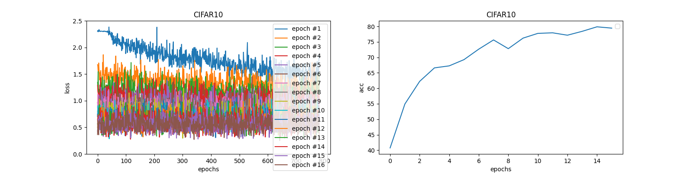

# pytorch-cifar10
Training DNN models with CIFAR-10/MNIST/FashinMNIST dataset

## Prerequisites

- Python 3.6+
- PyTorch 1.0+

## Training the models

Use cifar10.py for the training.

```shell-session
$ ./cifar10.py
```

Default configurations are defined in `Params` class of cifar-10.py

Some configurations can be overridden with command line options.

```
  --model   : Specify the model for a training. (Case sentitive)
              Currently, vgg{9,11,13,16,19}, resnet{9,18,34,50,101,152},
              wrn_16_10, wrn_28_10
              (Default : resnet18)
  --epochs  : Specify how meny epochs the model is trained. (Default 16)
  --workdir : Specify working directory to store weights and checkpoint.
              (Default: Current directory)
  --resume  : Resume from checkpoint
  --no_cuda : Force to run on CPU
```

cifar10.py script can be also running on Jupyter Netbook. (And Google Colab)  
Please copy models directory at the same location of the ipynb and use `Params` class to configure.  
On the Jupyter Notebook, you can see loss/accuracy results with matplotlib.

#### Examples

- Training ResNet18 model.
```shell-session
$ ./cifar10.py --model resnet18
```
You can get weights `cifar10-resnet18_weights_xxx.pth` for each xxx epochs under `weights` directory. symlink `cifar10-resnet18_weights.pth` points to the best accuracy weights.

- Resume from vgg11 training and continue to train until 50th epoch.
```shell-session
$ ./cifar10.py --model vgg11 --resume --epochs 50
```

### MNIST/FashionMNIST

This project optionally supports MNIST/FashinMNIST dataset.  
You can use `mnist.py` and `fashion_mnist.py` for training the models with mnist dataset.  

### Results

- Optimizer : Adam
- Learning Rate : 0.01
- Epochs : 16

|   Model   | CIFAR-10(%)  |   MNIST(%)   | FashionMNIST(%) |
|:---------:|:------------:|:------------:|:---------------:|
|  AlexNet  |     79.94    |              |                 |
|  ResNet9  |     88.00    |     99.29    |      93.33      |
| ResNet18  |     87.67    |     99.39    |      92.82      |
| ResNet34  |     87.52    |              |                 |
| ResNet50  |     85.71    |              |                 |
| WRN-16-10 |     88.54    |              |                 |
| WRN-28-10 |     88.94    |              |                 |
|   VGG11   |     85.71    |              |                 |
|   VGG13   |     88.74    |              |                 |
|   VGG16   |     88.34    |              |                 |
|   VGG19   |     87.63    |              |                 |

- AlexNet / CIFAR-10

- ResNet9 / CIFAR-10

- ResNet18 / CIFAR-10

- ResNet34 / CIFAR-10

- ResNet50 / CIFAR-10

- WideResNet 16-10 / CIFAR-10

- WideResNet 28-10 / CIFAR-10

- VGG 11 / CIFAR-10

- VGG 13 / CIFAR-10

- VGG 16 / CIFAR-10

- VGG 19 / CIFAR-10

- ResNet9 / MNIST

- ResNet18 / MNIST

- ResNet9 / FashionMNIST

- ResNet18 / FashionMNIST


### License

This project is licensed under the MIT License - see the [LICENSE](https://github.com/SangatsuUsagi/pytorch-cifar10/blob/master/LICENSE) file for details

## Acknowledgements

AlexNet, ResNet, WideResNet, and VGG model is ported from [bearpaw/pytorch-classification](https://github.com/bearpaw/pytorch-classification)

